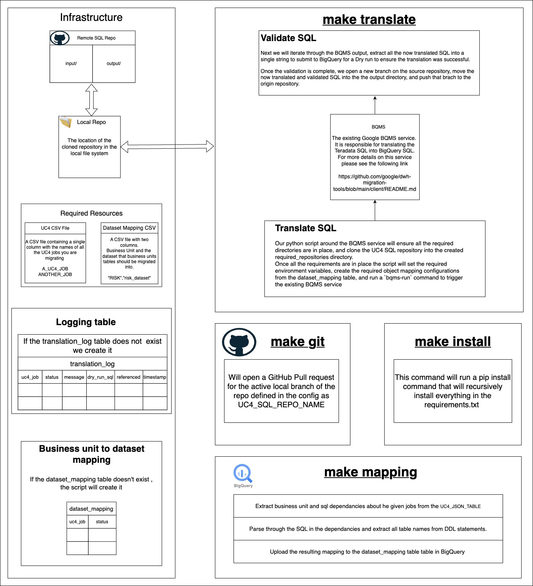

# BigQuery Migration Automation Tool
The BigQuery Migration Automation Tool is used with the BigQuery Migration Service to batch transpile all of the teradata SQLs to BigQuery SQLs and then validates those queries with Bigquery dry-run. Then the BigQuery SQLs are pushed to github as well as a transpilation logs table in BigQuery.   

## Architecture 

## Tools Used
* BQ Migration CLI - CLI tooling built by the BigQuery Migration Service team that allows you to interact with the BigQuery Migration Service.
* Makefile- A Makefile is used to run the python scripts, the pip installs and all the requirements needed to run the BigQuery Migration Automation Tool.   

## Required repositories 
UC4 SQL Repo\
This is the repository of all of the validated SQLs generated by the BigQuery Migration 
Service tool. The tool uploads the verified SQL to this repository.

Folder Structure:
<pre>
|-- Input
    |--radd_master_directory
        |-- my_sql.sql
        … 
|-- Output
    |--simba_directory
        |-- my_sql.sql
</pre>

The Input folder contains all of the Teradata SQLs for the UC4 Jobs.
The Output SQLs folder contains all of the converted BigQuery SQLs for the UC4 Jobs

DWH Migration Tools Repo\
This is the Github repository that contains the dwh-migration-tools that is required 
for the transpilation of the Teradata SQL.   

## Setup
the service consists of 4 parts as indicated by the Makefile.
The first part of the Makefile `make install`, which will install all the required dependencies for the BigQuery Migration service.

the `setup()` is run in two parts of the makefile. the `setup()` script will clone the required repos
into the local file system. If the given Github repo exists already in our local file system, we will 
do a git pull instead.   

## Teradata to BigQuery Dataset Mapping
The second part of the Makefile is the `make mapping` command, which runs the Teradata to BigQuery Dataset Mapping.
The Teradata to BigQuery Dataset Mapping parses through the given SQL for each job, extracts the table names attached to each job, 
and creates a mapping configuration file that maps those tables into the correct dataset for the associated business unit. 
It also uploads the mapping to a BigQuery table called `teradata to bq mapping`.
  

## Translate SQL
The third part of the Makefile is the `make translate` command which runs the transpilation,
validation and uploading to BigQuery. It also runs a portion of the  github integration as seen below.

### Transpilation
The transpilation is the process that takes the teradata SQL and transpiles it into BigQuery SQL.
This process is completed using `submit_job_to_bqms` function. The function sets the environment variables required by 
the BQMS tool and then runs the `bqms-run` command to initilize the transpilation process.   

### Dry Run
We then iterate through the files in the `BQMS_OUTPUT_FOLDER/translated` folder.
We submit a dry run for every query for each specific job.
If the query is successful the file will then be moved into the `UC4_SQL_REPO` in the bigquery_sql/ 
directory. If the query fails it will stay in the teradata_sql/ directory.   

### Transpilation Logs
At the end of the Dry-run validation, whether a dry-run is successful for not, 
the query data is uploaded to the transpilation_logs table in BigQuery,
where it can be accessed to get accurate logs for the dry-runs success' or failures. 
If the Dry-run is successful it will have a status of `SUCCEEDED`,
it will have the time the dry-run ran and the specific query that succeeded as well as any other SQLs the job referenced. 
If the dry-run fails it will have a status of `FAILED`, it will have the time the dry-run ran, 
the specific query that failed and the error message explaining why the dry-run validation wasn't successful as well as any SQLs the job referenced.  

### Github Integration
Upon completion of the validation process, the script will create a new branch in the repository, 
and push the new branch with its changes to the repository stored in github.
the last part of the Makefile `make git` will create a pull request for the most recent branch in the `UC4_SQL_REPO` repository.  

## Usage
In order to utilize this tool, you first need to clone the project into the directory of your choice 
`git clone https://github.com/RealistAI/bq_migration_automation_tool.git`, 
navigate into the newly cloned  directory `cd bq_migration_automation_tool`, and alter the config.py to your own specification. 
Create a Pip virtual environment using `pipenv shell` and then use the Makefile to install the requirements.txt by running `make install`, 
then you need to run `make mapping`, this will get the current Teradata to BigQuery object mapping. 
Finally you run the `make translate` command which will run the translation, validation and pushing the new changes to the github repository. 
Then you will run the optional `make git` if you desire to create a pull request for the most recent branch in the `UC4_SQL_REPO` repository.  

## Configuration Options
### Common Config

#### UC4_CSV_FILE

The CSV file containing a list of UC4 Jobs.  

#### METADATA_PROJECT

The GCP Project where the metadata will be stored. 

#### METADATA_DATASET

The GCP Dataset where the metadata will be stored. 

#### REPO_OWNER

The owner of the repository that is being sent the Pull request. 

#### UC4_JSON_TABLE

The UC4 XML to JSON conversion stores the JSON in a BigQuery table.  

#### UC4_SQL_REPO_NAME

The name of the repository containing the SQL's to transpile & validate 

#### UC4_SQL_REPO

The repository url and branch containing the SQL's to transpile & validate 

#### BASE_REPO_BRANCH

the main branch of the repository being sent the pull request. 

#### BASE_PATH

The base path for which the dataset mapping grabs the SQLs that is parses through and adjusts to work for BigQuery 

#### TOKEN

The token needed to create a pull request when running the `create_pull_request.py` file.  

### Generate Teradata to Bigquery Mapping Config

#### TD_TO_BQ_MAPPING_TABLE

the table that stores the Teradata to BigQuery Mapping 

#### BUSINESS_UNIT_DATASET_MAP_CSV_FILE

a CSV file containing the mapping between business units and datasets.  

### Translate SQL Config

#### TRANSLATION_LOG_TABLE

This is where the translate SQL will store the dry-run logs. 

#### BQMS_PROJECT

The name of the Google Cloud Platform project that will perform the bulk transpilation & validation 

#### BQMS_GCS_BUCKET

A Google Cloud Storage bucket that will be used by `bqms-run` as a staging area for the translation process 

#### BQMS_DEFAULT_DATABASE

determines the default database for tables if one is not specified in the SQL. 

#### BQMS_CLEAN_UP_TEMP_FILES

specifies whether or not the BQmS should clean up temp files after running. 

#### BQMS_INPUT_FOLDER

this is the directory where the BQMS will look for the SQLs that need to be converted. 

#### BQMS_OUTPUT_FOLDER

this is where the BQMS will write the transpilations to.  

#### BQMS_CONFIG_FOLDER

This is where the BQMS will look for the configurations. 

#### BQMS_CONFIG_FILE 

The path to the dwh-migration-tools config.yaml file. 

#### BQMS_OBJECT_MAPPING_FILE

The path to the object name mapping configuration file. 

#### SOURCE_SQL_PATH
The directory in your Github repository containing .sql files for translation and validation 

#### TARGET_SQL_PATH

The directory within the origin Github repository to contain the translated and validated .sql files. 

